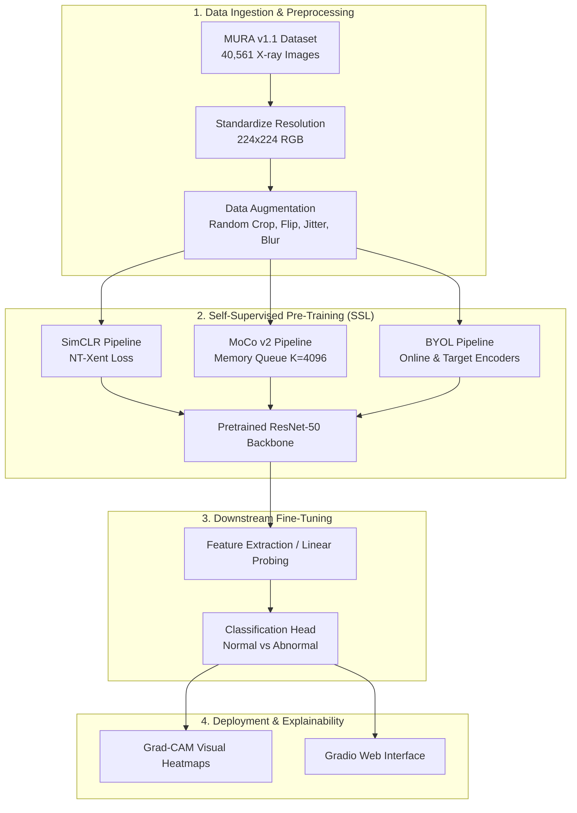
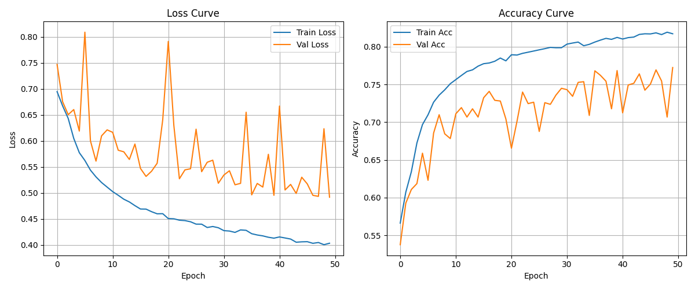
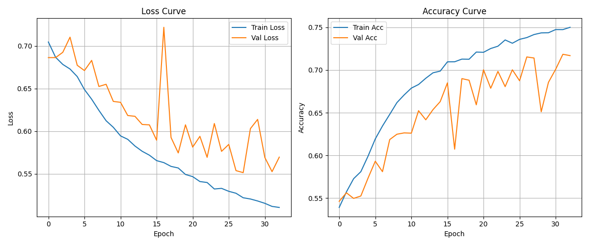
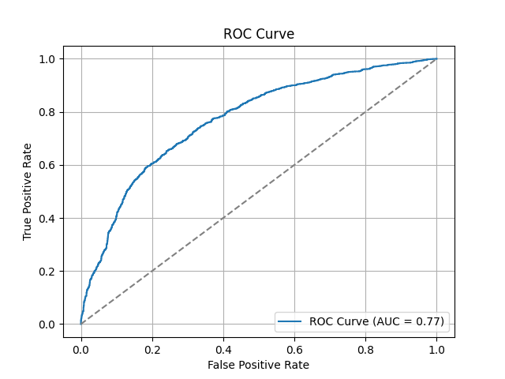
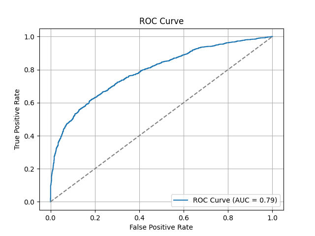
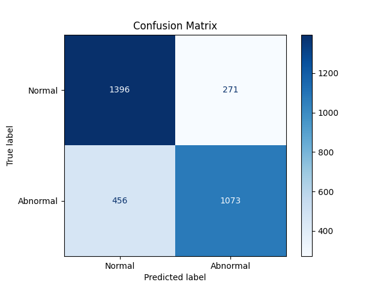
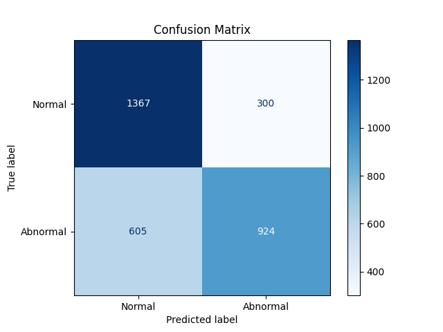
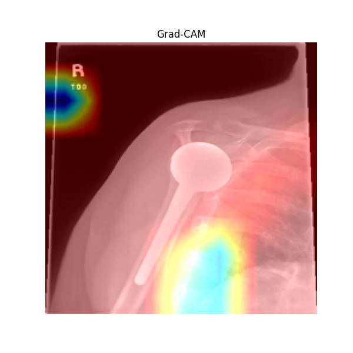
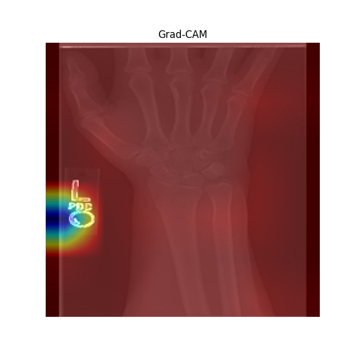

# Self-Supervised Learning for Abnormality Detection in Musculoskeletal Radiographs

[](https://www.python.org/)
[](https://pytorch.org/)
[](https://gradio.app/)
[](https://stanfordmlgroup.github.io/competitions/mura/)
[](LICENSE)

> **East West University | Department of Computer Science and Engineering**  
> **Course:** CSE 475 | **Group:** 7  
> **Date:** May 21, 2025

---

## 📌 Project Overview

Musculoskeletal disorders affect more than **1.7 billion people worldwide** and represent a primary cause of long-term pain and physical impairment. While radiographic imaging (X-rays) is standard for diagnosing fractures, structural abnormalities, and joint diseases, manual evaluation by radiologists is labor-intensive and subject to diagnostic fatigue and inter-observer variability.

Although deep learning models have achieved high diagnostic accuracy on radiographic benchmarks, supervised approaches depend heavily on massive, expert-annotated datasets—an expensive and scarce resource in clinical AI.

This repository implements and evaluates **Self-Supervised Learning (SSL)** frameworks—**SimCLR**, **MoCo (Momentum Contrast v2)**, and **BYOL**—paired with a **ResNet-50** backbone to detect abnormalities across musculoskeletal radiographs from the Stanford **MURA v1.1** dataset without relying extensively on annotated labels during feature representation learning.

---

## 🚀 Key Highlights

- **Label-Efficient Representation Learning:** Pretrains ResNet-50 encoders using contrastive and non-contrastive self-supervised pretext tasks directly on unannotated radiographic images.
- **Multiple SSL Paradigms:**
  - **SimCLR:** Contrastive learning with NT-Xent (Normalized Temperature-scaled Cross Entropy) loss and projection head.
  - **MoCo v2:** Momentum contrast with dynamic memory bank queue ($K = 4096$) and moving-average key encoder.
  - **BYOL:** Non-contrastive representation learning using online and target networks without negative pairs.
- **Downstream Fine-Tuning:** End-to-end and linear probing classification pipelines for binary diagnosis (**Normal** vs. **Abnormal**).
- **Clinical Interpretability (Grad-CAM):** Gradient-weighted Class Activation Mapping to visually validate anatomical regions influencing diagnostic decisions (e.g., fractures, implants, joint spaces).
- **Interactive Web Demonstration:** An intuitive web UI powered by **Gradio** for interactive radiographic image diagnosis.

---

## 📊 Performance & Comparative Analysis

Evaluation was conducted on the Stanford MURA-v1.1 validation set (3,196 radiographic images).

| Metric | SimCLR + Classifier | MoCo v2 + Classifier |
| :--- | :---: | :---: |
| **Backbone** | ResNet-50 | ResNet-50 |
| **Pre-training Epochs** | 50 (Early stopped) | 50 (Early stopped @ epoch 33) |
| **Training Loss** | **0.4031** | 0.5107 |
| **Validation Loss** | **0.4916** | 0.5696 |
| **Training Accuracy** | **81.73%** | 75.00% |
| **Validation Accuracy** | **77.25%** | 71.68% |
| **AUROC** | 0.77 | **0.79** |
| **Normal Precision / Recall** | 0.75 / 0.84 | 0.69 / 0.82 |
| **Abnormal Precision / Recall** | 0.80 / 0.70 | 0.75 / 0.60 |
| **Normal F1-score** | **0.79** | 0.75 |
| **Abnormal F1-score** | **0.75** | 0.67 |

> **Key Findings:**  
> - **SimCLR** achieved superior overall classification accuracy (**77.25%**) and lower validation loss.  
> - **MoCo v2** demonstrated higher discriminative capability under threshold variation, attaining a higher **AUROC of 0.79**.  
> - Both models confirmed that SSL representations generalize effectively to unseen medical imagery.

---

## 🏗️ System Architecture



---

## 📈 Visualizations

### 1. Training & Validation Dynamics
| SimCLR Learning Curves | MoCo Learning Curves |
| :---: | :---: |
|  |  |

### 2. ROC-AUC Curves & Confusion Matrices
| SimCLR ROC & Confusion Matrix | MoCo ROC & Confusion Matrix |
| :---: | :---: |
|  |  |
|  |  |

### 3. Model Explainability with Grad-CAM
Grad-CAM heatmaps highlight relevant anatomical features (fractures, implants, and joint boundaries):

| SimCLR Grad-CAM Focus | MoCo Grad-CAM Focus |
| :---: | :---: |
|  |  |

---

## 📁 Repository Structure

```plaintext
CSE475/
├── plots/                             # Generated performance charts & Grad-CAM outputs
│   ├── training_curves.png            # SimCLR loss & accuracy curves
│   ├── moco_training_curves.png       # MoCo loss & accuracy curves
│   ├── byol_loss_plot.png             # BYOL loss curve
│   ├── roc_auc_curve.png              # SimCLR ROC-AUC curve
│   ├── moco_roc_auc_curve.png         # MoCo ROC-AUC curve
│   ├── confusion_matrix.png           # SimCLR confusion matrix
│   ├── moco_confusion_matrix.png      # MoCo confusion matrix
│   ├── Gradcam_Figure_2.png           # SimCLR Grad-CAM activation samples
│   └── gradcam_Figure_3.png           # MoCo Grad-CAM activation samples
├── training/                          # Core training and evaluation scripts
│   ├── app.py                         # Interactive Gradio web application
│   ├── train.py                       # SimCLR self-supervised pre-training
│   ├── classifier.py                  # SimCLR classifier fine-tuning & evaluation
│   ├── train_moco.py                  # MoCo v2 pre-training
│   ├── classifierMOCO.py              # MoCo classifier fine-tuning & evaluation
│   ├── boyal_train.py                 # BYOL pre-training implementation
│   ├── gradcam.py                     # Grad-CAM visualization generation (SimCLR)
│   ├── MOCO_gradcam.py                # Grad-CAM visualization generation (MoCo)
│   ├── csv_marge.py                   # CSV label merging utility
│   ├── balanced_train_image_labels.csv# Preprocessed label metadata
│   └── submission/                    # Modularized submission files
│       ├── Sim-CLR_train.py
│       ├── Sim-CLR_classifier.PY
│       ├── Sim-CLR_gradcam.py
│       ├── MOCO_train.py
│       ├── MOCO_classifier.py
│       ├── MOCO_gradcam.py
│       └── BYOL_train.py
├── moco_training_log.txt              # Epoch logs for MoCo classifier fine-tuning
├── training_log.txt                   # Epoch logs for SimCLR classifier fine-tuning
├── Report.pdf                         # Comprehensive academic research report
└── README.md                          # Project documentation
```

---

## 🛠️ Installation & Setup

### 1. Prerequisites
- **OS:** Windows 10/11, Linux, or macOS
- **Python:** Version 3.8 to 3.11
- **CUDA:** Recommended for GPU acceleration (e.g., NVIDIA RTX 30/40 series)

### 2. Clone the Repository
```bash
git clone https://github.com/<your-username>/CSE475.git
cd CSE475
```

### 3. Create a Virtual Environment
```bash
# Using venv
python -m venv venv
# Activate on Windows:
venv\Scripts\activate
# Activate on Linux/macOS:
source venv/bin/activate
```

### 4. Install Dependencies
```bash
pip install torch torchvision --index-url https://download.pytorch.org/whl/cu118
pip install pandas numpy pillow matplotlib opencv-python scikit-learn tqdm gradio
```

---

## 📦 Dataset Preparation (Stanford MURA v1.1)

1. Download the [Stanford MURA Dataset v1.1](https://stanfordmlgroup.github.io/competitions/mura/).
2. Extract the dataset into the project directory under a `Dataset/` folder:
   ```plaintext
   Dataset/
   └── MURA-v1.1/
       ├── train/
       ├── valid/
       ├── train_image_paths.csv
       ├── valid_image_paths.csv
       ├── train_labeled_studies.csv
       └── valid_labeled_studies.csv
   ```
3. Run the CSV preprocessing script if needed:
   ```bash
   python training/csv_marge.py
   ```

---

## 💻 How to Run

### 1. Self-Supervised Pre-Training
Pretrain the ResNet-50 feature encoder using either SimCLR, MoCo v2, or BYOL:

```bash
# SimCLR pre-training
python training/train.py

# MoCo v2 pre-training
python training/train_moco.py

# BYOL pre-training
python training/boyal_train.py
```

### 2. Fine-Tuning the Downstream Classifier
Train the binary classification head on top of the pretrained representation:

```bash
# Fine-tune SimCLR classifier
python training/classifier.py

# Fine-tune MoCo classifier
python training/classifierMOCO.py
```

### 3. Generate Grad-CAM Visualizations
Inspect model attention heatmaps on validation radiographs:

```bash
# Grad-CAM for SimCLR
python training/gradcam.py

# Grad-CAM for MoCo
python training/MOCO_gradcam.py
```

### 4. Launch the Gradio Web Application
Launch the local web app to diagnose X-ray images interactively:

```bash
python training/app.py
```
Open your browser and navigate to the local link (typically `http://127.0.0.1:7860`).

---

## 👥 Contributors (Group 7)

- **Fardin Rahman** — Student ID: `2021-2-60-008`
- **Ramisa Hossain Arna** — Student ID: `2021-2-60-002`
- **Nafisa Hossain Arpa** — Student ID: `2021-2-60-004`
- **Md. Sajjad Hossain** — Student ID: `2021-2-60-136`

**Course:** CSE 475 — Machine Learning / Pattern Recognition  
**Institution:** [East West University](https://www.ewubd.edu/)

---

## 📖 References

1. Rajpurkar, P., Irvin, J., Bagul, A., et al. (2017). *MURA: Large dataset for abnormality detection in musculoskeletal radiographs.* [arXiv:1712.06957](https://arxiv.org/abs/1712.06957).
2. Chen, T., Kornblith, S., Norouzi, M., & Hinton, G. (2020). *A Simple Framework for Contrastive Learning of Visual Representations (SimCLR).* ICML 2020.
3. He, K., Fan, H., Wu, Y., Xie, S., & Girshick, R. (2020). *Momentum Contrast for Unsupervised Visual Representation Learning (MoCo).* CVPR 2020.
4. Grill, J. B., Strub, F., Altché, F., et al. (2020). *Bootstrap Your Own Latent: A New Approach to Self-Supervised Learning (BYOL).* NeurIPS 2020.
5. Selvaraju, R. R., Cogswell, M., Das, A., Vedaldi, A., Parikh, D., & Batra, D. (2017). *Grad-CAM: Visual Explanations from Deep Networks via Gradient-Based Localization.* ICCV 2017.
